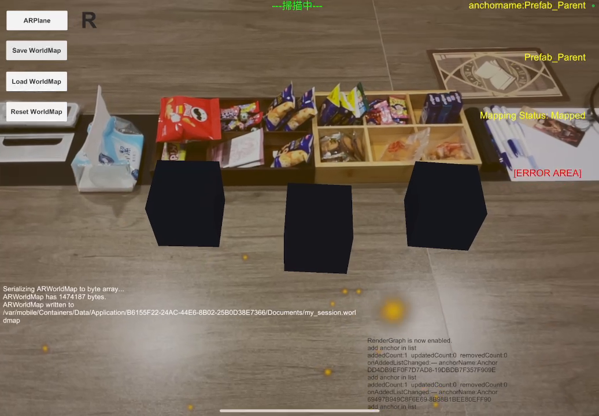
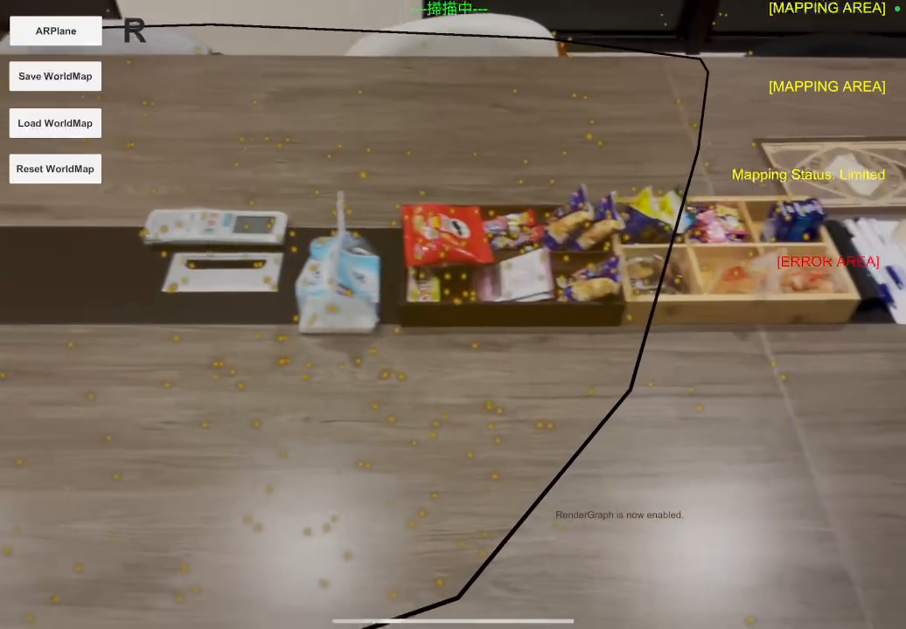
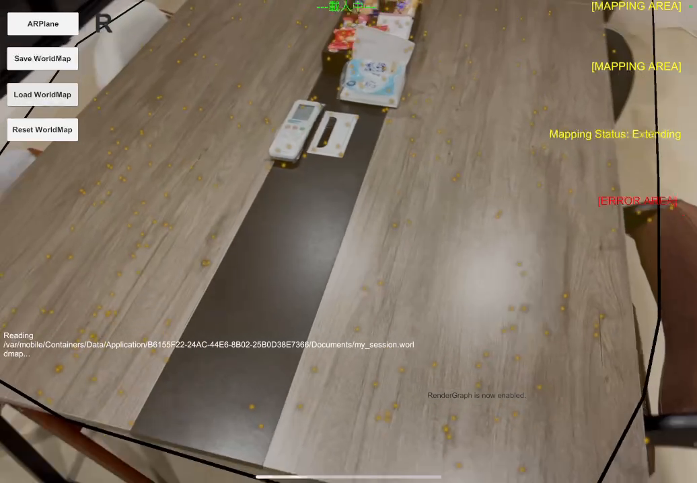

# -AR_Shared_Space

https://github.com/user-attachments/assets/5c813f33-a62f-4794-b5e6-d6a82f18c095

# AR Shared Space — ARKit WorldMap 多人共享空間

> 使用 **AR Foundation + ARKit** 開發的多人 AR 共享空間專案。透過掃描實體環境建立 `ARWorldMap`，並以 **TCP Socket** 將地圖檔案傳輸給其他玩家，使雙方裝置能夠重建出同一份空間座標系統，進而在真實世界的同一個位置看到相同的虛擬物件。



---

## 專案動機

多人 AR 應用最核心的挑戰之一，是如何讓「不同裝置」對「同一個實體空間」建立一致的座標認知。ARKit 原生的 `ARWorldMap` 提供了空間特徵點雲與已放置的 Anchor 資訊，但預設情境是單機的「儲存 / 讀取」。

這個專案將 `ARWorldMap` 的序列化資料透過網路傳輸出去，讓另一台裝置可以載入同一份地圖並完成 **Relocalization（重定位）**，藉此在沒有雲端服務（如 Firebase、ARCore Cloud Anchor）的情況下，用最輕量的方式做出「本地端多人 AR 共享空間」。

---

## 核心功能

- **即時空間掃描與 Mapping 狀態監控**
  畫面右側即時顯示 ARKit 的 `worldMappingStatus`（`Limited` / `Extending` / `Mapped` / `NotAvailable`），引導使用者移動裝置以完成環境掃描。

- **Anchor 放置與管理**
  掃描過程中可放置具名 Anchor（如 `Prefab_Parent`），作為之後虛擬物件掛載的座標基準點。

- **WorldMap 序列化 / 儲存**
  按下 `Save WorldMap` 後，將 `ARWorldMap` 序列化為 byte array（示範中約 1.47 MB）並寫入裝置本機檔案系統。

- **WorldMap 讀取與重定位**
  另一端按下 `Load WorldMap`，從檔案（或透過 TCP 接收後暫存）讀入資料並還原 `ARWorldMap`，ARKit 會自動嘗試比對特徵點雲完成重定位，狀態會經歷 `Extending → Mapped`。

- **TCP 傳輸模組**
  將儲存好的 WorldMap 檔案透過 TCP Socket 傳送給同一 Wi-Fi 網段下的另一台裝置，不依賴任何第三方雲端後端，達成「點對點」的地圖共享。

- **平面偵測（ARPlane）與除錯視覺化**
  即時顯示偵測到的平面、特徵點（黃色點雲）與環境掃描邊界，方便開發階段除錯。

---

## 系統流程

```
裝置 A（建圖端）                          裝置 B（加入端）
─────────────────────                   ─────────────────────
1. AR Session 啟動
2. 掃描環境 (ARPlane + Feature Points)
3. 放置 Anchor（共享座標基準）
4. Save WorldMap
   └─ ARWorldMap 序列化為 byte[]
5. 透過 TCP Socket 傳送檔案 ───────────▶ 6. TCP Server 接收 byte[]
                                          7. Load WorldMap
                                             └─ 還原 ARWorldMap
                                          8. ARKit 比對特徵點雲
                                             （Mapping Status: Extending）
                                          9. 重定位成功
                                             （Mapping Status: Mapped）
                                         10. 雙方裝置共享同一座標系統
                                             → 在相同實體位置看到相同虛擬物件
```

---

## 技術棧

| 類別 | 技術 |
|---|---|
| AR 框架 | AR Foundation、ARKit（`ARWorldMap` / `ARAnchorManager` / `ARPlaneManager`） |
| 引擎 | Unity |
| 網路傳輸 | C# `System.Net.Sockets`（TCP Client / Server） |
| 資料處理 | ARWorldMap 序列化、byte array 傳輸與還原 |
| 平台 | iOS（ARKit 僅支援 iOS 裝置） |

---

## 展示畫面

| 環境掃描與 Mapping 狀態 | 放置 Anchor 並儲存 WorldMap | 另一端載入 WorldMap |
|---|---|---|
|  |  |  |

> 完整操作流程請參考專案內附示範影片。

---

## 開發過程中的挑戰

- **Mapping Status 的即時判讀**：需要清楚呈現 `Limited / Extending / Mapped / NotAvailable` 等狀態給使用者，避免玩家在地圖尚未收斂完成前就嘗試載入，導致重定位失敗。
- **大檔案的網路傳輸穩定性**：`ARWorldMap` 序列化後動輒 1MB 以上，需要處理 TCP 傳輸的分包、封包完整性驗證與傳輸進度回饋。
- **重定位失敗的容錯處理**：光線、環境特徵不足或裝置移動過快都可能導致 `Load WorldMap` 後遲遲無法從 `Extending` 進入 `Mapped`，需要設計對應的提示與重試機制。

## 未來規劃

- [ ] 將點對點 TCP 傳輸改為區域網路自動探索（Bonjour / mDNS），免去手動輸入 IP
- [ ] 支援多人（3 人以上）同時加入同一份共享空間
- [ ] 加入雲端備援方案，於重定位失敗時可退回雲端錨點服務
- [ ] 優化 UI，將除錯用文字資訊轉為正式的使用者引導介面

---

## 授權

本專案為個人作品集展示用途。

